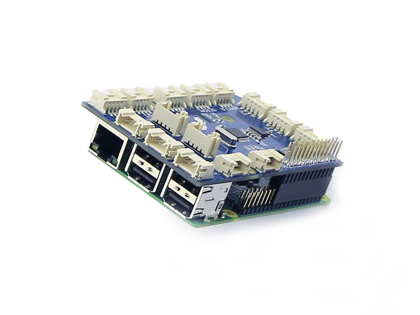

## Stacking It

To get the GrovePi up and running we first need to attach the GrovePi to the RaspberryPi. It's
a very simple process where it only needs to be stacked on top the GrovePi just like with any other hat.

Before powering the Pi up, you need to make sure there's no foam sticked to the headers as that
can trigger the Raspberry Pi to reboot. That's because the foam is electrically conductive and it
basically shorts the pins.

In the end the GrovePi will sit on the Raspberry Pi like in the following photo.



## How to Install

When it comes to installation there are 2 ways to do it:

1. By using our pre-made image called [Raspbian For Robots](https://sourceforge.net/projects/dexterindustriesraspbianflavor/).
1. By using a fresh Raspbian image and running our install command.

#### For Raspbian For Robots Image

The benefit of using our image is that you don't have to worry about installing the GrovePi - because it's already on it.
Still after a while you will be required to run updates via the console or via our GUI app in order to get the latest.

#### For Manual Installation

On the other hand, when using a fresh Raspbian image the initial installation takes some time, but subsequent updates take
way less. The disadvantage with method is that you don't get the other robots installed too, so if you don't want to use
other robots from our family then this method is the preferred one.

To install the GrovePi on a fresh image of Raspbian, run the following command:
```bash
curl -kL dexterindustries.com/update_grovepi | bash
```

#### How to Update to a Newer Version

Regardless of how you got the GrovePi installed (manually or by getting the Raspbian For Robots image), there's only one way to update
to the latest version:
```bash
curl -kL dexterindustries.com/update_grovepi | bash
```

As you can see it's basically the same command used for installing the library on a fresh Raspbian image.

## Where Is It Installed

Upon installing the GrovePi or getting our flavored image the GrovePi library can be found in `/home/pi/Dexter/GrovePi` directory.

The `/home/pi/Dexter/GrovePi` is a mirrored version of [our GitHub repository](https://github.com/DexterInd/GrovePi/tree/master) of the master branch.

## What I2C Bus to Use

By default, the GrovePi library is set to use the `RPI_1SW` bus, which is a software implementation of the I2C specifically built to circumvent
the issues with the hardware I2C of the Raspberry Pi. It's very fast and it doesn't use much CPU time at all. We recommend using this bus, thus,
when importing the `grovepi` module, you don't have to do anything.

There's also the `RPI_1`, the classic HW I2C of the Raspberry Pi, which is buggy and unreliable. We don't see any reason in using this one in any scenario. Period.

In order to change the bus, presumably to `RPI_1` bus, call `grovepi.set_bus("RPI_1")` or `grovepi.set_bus("RPI_1SW")` in case you've changed the default one.

## Scratch Support

Scratch support comes by default with our flavored image, Raspbian For Robots, but if you find yourself to be using the classic Raspbian then
you also need to run the following command after you have installed the GrovePi:
```bash
sudo bash /home/pi/Dexter/GrovePi/Script/install_scratch.sh
```

## Community Support

To find out more on the GrovePi you can visit our forum and check for threads with the [grovepi tag](https://forum.dexterindustries.com/tags/grovepi)
or by going to the [GrovePi category](https://forum.dexterindustries.com/c/grovepi).
